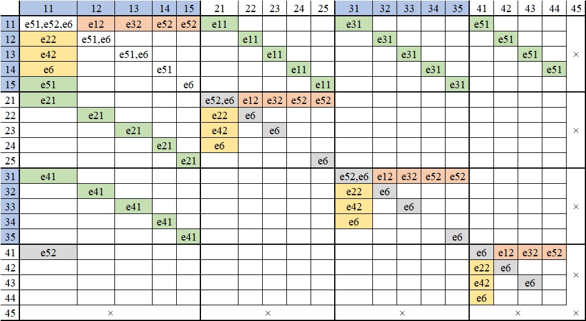

# 多机器

所有多机器理论，法国人都只考虑两机器

状态切换理论：同时只能触发一个事件。一般而言，两个机器的状态不可能同时发生变化。但也有例外：若并行生产，两个机器都是满仓状态。交货时，它们都变为生产中，此时它们的状态同时发生变化

双机器事件下标名称：第1位是事件名，第2位是机器名

# 并行生产 parallèle

法国人认为

- 只考虑两机器并行，虽然代码上两机器和多机器是一样的
- 交货事件是通用事件，只有1位下标

## 事件一览

| 编号  | 中文名              | 流程  |
| :---: | :------------------ | :---: |
|  e11  | 机器1故障了         | 生产  |
|  e21  | 机器1修好了         | 生产  |
|  e31  | 机器1开始维护       | 生产  |
|  e41  | 机器1完成维护       | 生产  |
|  e51  | 机器1生产了一个产品 | 生产  |
|  e12  | 机器2故障了         | 生产  |
|  e22  | 机器2修好了         | 生产  |
|  e32  | 机器2开始维护       | 生产  |
|  e42  | 机器2完成维护       | 生产  |
|  e52  | 机器2生产了一个产品 | 生产  |
|  e6   | 客户拿货            | 交付  |

## 状态一览

编号：每一位的含义同单机器。第1位是机器1，第2位是机器2

| 编号  |         可能的事件         |
| :---: | :------------------------: |
|  11   | e11,e12,e31,e32,e51,e52,e6 |
|  12   |     e11,e31,e51,e22,e6     |
|  13   |     e11,e31,e51,e42,e6     |
|  14   |       e11,e31,e51,e6       |
|  21   |     e21,e12,e31,e52,e6     |
|  22   |         e21,e22,e6         |
|  23   |         e21,e42,e6         |
|  24   |           e21,e6           |
|  31   |     e41,e12,e32,e52,e6     |
|  32   |         e41,e22,e6         |
|  33   |         e41,e42,e6         |
|  34   |           e41,e6           |
|  41   |       e12,e32,e52,e6       |
|  42   |           e22,e6           |
|  43   |           e42,e6           |
|  44   |             e6             |

## 状态转换表

<!-- |       |     11     |   12   |   13   |  14   |   21   |  22   |  23   |  24   |   31   |  32   |  33   |  34   |  41   |  42   |  43   |  44   |
| :---: | :--------: | :----: | :----: | :---: | :----: | :---: | :---: | :---: | :----: | :---: | :---: | :---: | :---: | :---: | :---: | :---: |
|  11   | e51,e52,e6 |  e12   |  e32   |  e52  |  e11   |       |       |       |  e31   |       |       |       |  e51  |       |       |       |
|  12   |    e22     | e51,e6 |        |       |        |  e11  |       |       |        |  e31  |       |       |       |  e51  |       |       |
|  13   |    e42     |        | e51,e6 |       |        |       |  e11  |       |        |       |  e31  |       |       |       |  e51  |       |
|  14   |     e6     |        |        |       |        |       |       |  e11  |        |       |       |  e31  |       |       |       |  e51  |
|  21   |    e21     |        |        |       | e52,e6 |  e12  |  e32  |  e52  |        |       |       |       |       |       |       |       |
|  22   |            |  e21   |        |       |  e22   |  e6   |       |       |        |       |       |       |       |       |       |       |
|  23   |            |        |  e21   |       |  e42   |       |  e6   |       |        |       |       |       |       |       |       |       |
|  24   |            |        |        |  e21  |   e6   |       |       |       |        |       |       |       |       |       |       |       |
|  31   |    e41     |        |        |       |        |       |       |       | e52,e6 |  e12  |  e32  |  e52  |       |       |       |       |
|  32   |            |  e41   |        |       |        |       |       |       |  e22   |  e6   |       |       |       |       |       |       |
|  33   |            |        |  e41   |       |        |       |       |       |  e42   |       |  e6   |       |       |       |       |       |
|  34   |            |        |        |  e41  |        |       |       |       |   e6   |       |       |       |       |       |       |       |
|  41   |     e6     |        |        |       |        |       |       |       |        |       |       |       |       |  e12  |  e32  |  e52  |
|  42   |            |   e6   |        |       |        |       |       |       |        |       |       |       |  e22  |       |       |       |
|  43   |            |        |   e6   |       |        |       |       |       |        |       |       |       |  e42  |       |       |       |
|  44   |     e6     |        |        |       |        |       |       |       |        |       |       |       |       |       |       |       | -->

# 串行生产 série

机器1生产半成品，放进箱子1，机器2从箱子1拿半成品，生产成品，放进箱子2。每1个半成品可以生产1个成品

每个生产环节都有彼此独立的常量

## 事件一览

| 编号  | 中文名                                  |    流程    |
| :---: | :-------------------------------------- | :--------: |
|  e11  | 机器1故障了                             | 生产半成品 |
|  e21  | 机器1修好了                             | 生产半成品 |
|  e31  | 机器1开始维护                           | 生产半成品 |
|  e41  | 机器1完成维护                           | 生产半成品 |
|  e51  | 机器1生产了一个半成品                   | 生产半成品 |
|  e12  | 机器2故障了                             |  生产成品  |
|  e22  | 机器2修好了                             |  生产成品  |
|  e32  | 机器2开始维护                           |  生产成品  |
|  e42  | 机器2完成维护                           |  生产成品  |
|  e52  | 机器2生产了一个成品，接着取走一个半成品 |  生产成品  |
|  e6   | 客户拿货                                |    交付    |

## 状态一览

### 机器2

| 编号  |    字母    | 中文名       | 可能的事件  |
| :---: | :--------: | :----------- | :---------: |
|   1   |    Fon     | 生产中       | e1,e3,e5,e6 |
|   2   |     MC     | 维修中       |    e2,e6    |
|   3   |     MP     | 维护中       |    e4,e6    |
|   4   | b-M1-plein | 机器2满仓中  |     e6      |
|   5   | b-M1-vide  | 无半成品原料 |     e6      |

### 复合状态

| 编号  |         可能的事件         |
| :---: | :------------------------: |
|  11   | e11,e31,e51,e12,e32,e52,e6 |
|  12   |     e11,e31,e51,e22,e6     |
|  13   |     e11,e31,e51,e42,e6     |
|  14   |       e11,e31,e51,e6       |
|  15   |       e11,e31,e51,e6       |
|  21   |     e21,e12,e32,e52,e6     |
|  22   |         e21,e22,e6         |
|  23   |         e21,e42,e6         |
|  24   |           e21,e6           |
|  25   |           e21,e6           |
|  31   |     e41,e12,e32,e52,e6     |
|  32   |         e41,e22,e6         |
|  33   |         e41,e42,e6         |
|  34   |           e41,e6           |
|  35   |           e41,e6           |
|  41   |       e12,e32,e52,e6       |
|  42   |           e22,e6           |
|  43   |           e42,e6           |
|  44   |             e6             |
|  45   |             x              |

## 状态转换表

<!-- |       |     11     |   12   |   13   |  14   |  15   |   21   |  22   |  23   |  24   |  25   |   31   |  32   |  33   |  34   |  35   |  41   |  42   |  43   |  44   |  45   |
| :---: | :--------: | :----: | :----: | :---: | :---: | :----: | :---: | :---: | :---: | :---: | :----: | :---: | :---: | :---: | :---: | :---: | :---: | :---: | :---: | :---: |
|  11   | e51,e52,e6 |  e12   |  e32   |  e52  |  e52  |  e11   |       |       |       |       |  e31   |       |       |       |       |  e51  |       |       |       |   x   |
|  12   |    e22     | e51,e6 |        |       |       |        |  e11  |       |       |       |        |  e31  |       |       |       |       |  e51  |       |       |   x   |
|  13   |    e42     |        | e51,e6 |       |       |        |       |  e11  |       |       |        |       |  e31  |       |       |       |       |  e51  |       |   x   |
|  14   |     e6     |        |        |  e51  |       |        |       |       |  e11  |       |        |       |       |  e31  |       |       |       |       |  e51  |   x   |
|  15   |    e51     |        |        |       |  e6   |        |       |       |       |  e11  |        |       |       |       |  e31  |       |       |       |       |   x   |
|  21   |    e21     |        |        |       |       | e52,e6 |  e12  |  e32  |  e52  |  e52  |        |       |       |       |       |       |       |       |       |   x   |
|  22   |            |  e21   |        |       |       |  e22   |  e6   |       |       |       |        |       |       |       |       |       |       |       |       |   x   |
|  23   |            |        |  e21   |       |       |  e42   |       |  e6   |       |       |        |       |       |       |       |       |       |       |       |   x   |
|  24   |            |        |        |  e21  |       |   e6   |       |       |       |       |        |       |       |       |       |       |       |       |       |   x   |
|  25   |            |        |        |       |  e21  |        |       |       |       |  e6   |        |       |       |       |       |       |       |       |       |   x   |
|  31   |    e41     |        |        |       |       |        |       |       |       |       | e52,e6 |  e12  |  e32  |  e52  |  e52  |       |       |       |       |   x   |
|  32   |            |  e41   |        |       |       |        |       |       |       |       |  e22   |  e6   |       |       |       |       |       |       |       |   x   |
|  33   |            |        |  e41   |       |       |        |       |       |       |       |  e42   |       |  e6   |       |       |       |       |       |       |   x   |
|  34   |            |        |        |  e41  |       |        |       |       |       |       |   e6   |       |       |       |       |       |       |       |       |   x   |
|  35   |            |        |        |       |  e41  |        |       |       |       |       |        |       |       |       |  e6   |       |       |       |       |   x   |
|  41   |    e52     |        |        |       |       |        |       |       |       |       |        |       |       |       |       |  e6   |  e12  |  e32  |  e52  |   x   |
|  42   |            |        |        |       |       |        |       |       |       |       |        |       |       |       |       |  e22  |  e6   |       |       |   x   |
|  43   |            |        |        |       |       |        |       |       |       |       |        |       |       |       |       |  e42  |       |  e6   |       |   x   |
|  44   |            |        |        |       |       |        |       |       |       |       |        |       |       |       |       |  e6   |       |       |       |   x   |
|  45   |     x      |   x    |   x    |   x   |   x   |   x    |   x   |   x   |   x   |   x   |   x    |   x   |   x   |   x   |   x   |   x   |   x   |   x   |   x   |   x   | -->
