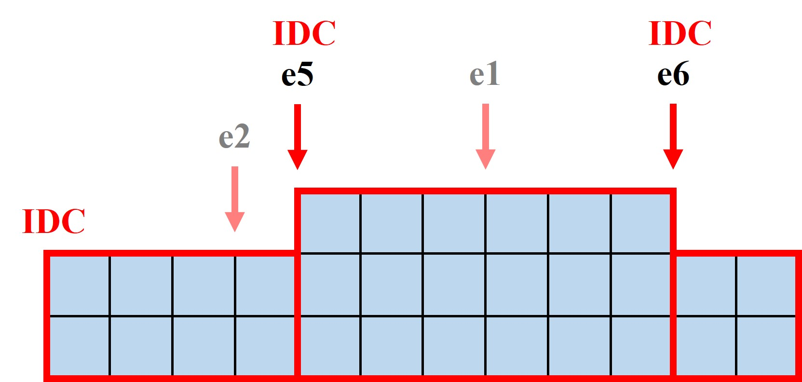
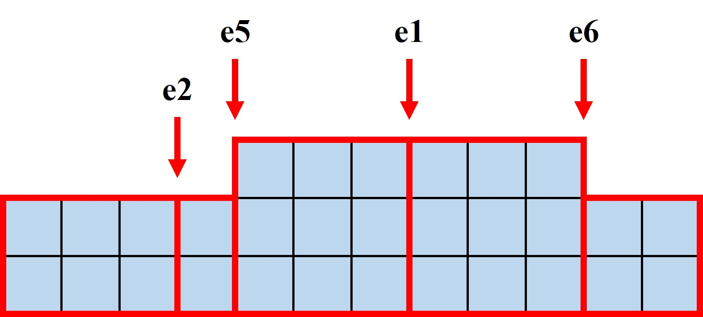

# 两个机器的关系

- 主要机器的决策完全不受备用机器状态的影响
- 主要机器在开始维护或维修时向备用机器发起请求
- 备用机器在事件点检测主要机器的状态来决定自身行为

# 花钱的时机

维护和维修都是开始时花钱，产品生产是结束时花钱

# 维修与维护的关系

- 维护**开始**时就刷新维修，并立刻更改本次维护完成时间
- 维护完成后，把维护完成时间改为NaN
- 维修刷新时间要加上一个维护的长度
- 维修维护互换同理
- 交货独立于维修或维护计算

# 维护或维修期间延后其他事件

维护或维修开始时直接令生产出产品的时间**延后**对应的区间时长

# 满仓

- 机器的出料口可以存一个产品
- **满仓**不单独作为一个状态，因为其本质上是**生产中**状态。
  - 满仓和生产中的机制几乎一样。唯一的区别在于，满仓状态生产出的产品无法进入仓库，且花费变为0
  - 用变量ns_full表示是否满仓
  - 通过这种方式减少复杂度

# 仓储成本

传统计算仓储成本的方法引入了变量IDC。计算原理如图所示：

本项目在发生任何事件前都结算一次仓储成本。计算原理如图所示：

这样无需引入变量IDC，减少复杂度。

# 状态-事件驱动表

| 事件 \ 状态 |   1   |   2   |   3   |
| :-------------------------------: | :---: | :---: | :---: |
|                e1                 |  c1   |       |       |
|                e2                 |       |  c2   |       |
|                e3                 |  c3   |       |       |
|                e4                 |       |       |  c4   |
|                e5                 |  c5   |       |       |
|                e6                 |  c6   |  c6   |  c6   |
